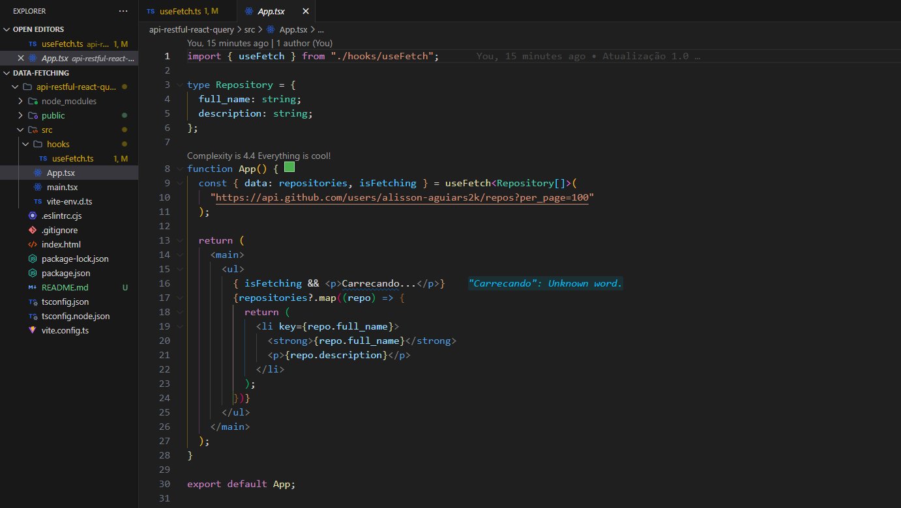

# Consumo de APIs RESTful no React com a biblioteca React Query e Axios.

## Descrição do Projeto:

### A proposta do projeto foi cosumir APIs RESTful no React da maneira correta, utilizando a biblioteca React Query;

### App.tsx

### useFetch.ts

=======
 

## O que é React Query?

### React Query é uma biblioteca usada para trabalhar com requisições assíncronas, trazendo o conceito de estado do servidor para o desenvolvimento React, tem uma configuração inicial simples e sem necessidade de customização.

 

## Tecnologias que utilizei para o projeto ;

 

    
    

 

## Creditos:

### Este projeto foi desenvolvido em aula com o professor Diego Fernandes, Rocketseat.

